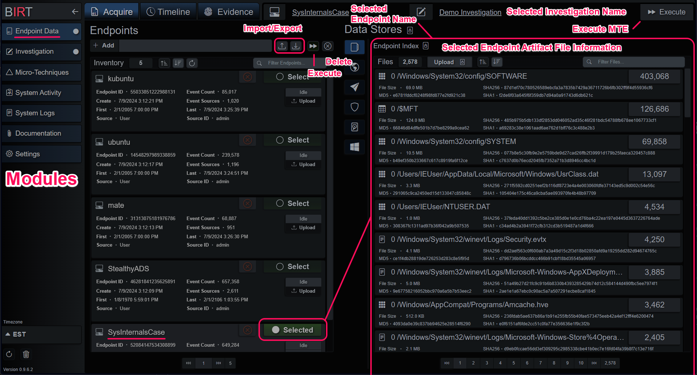
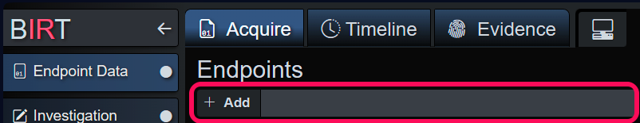
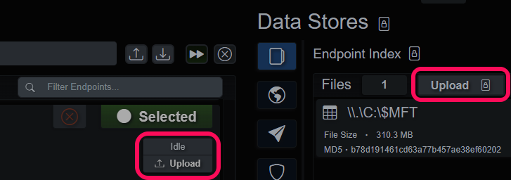
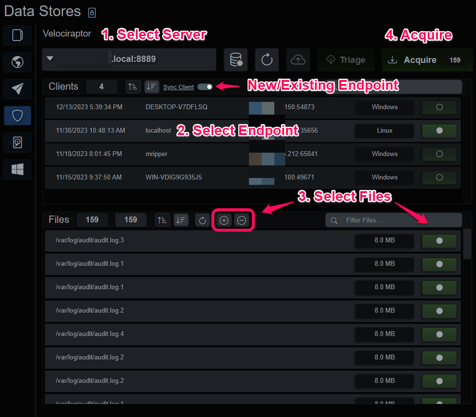
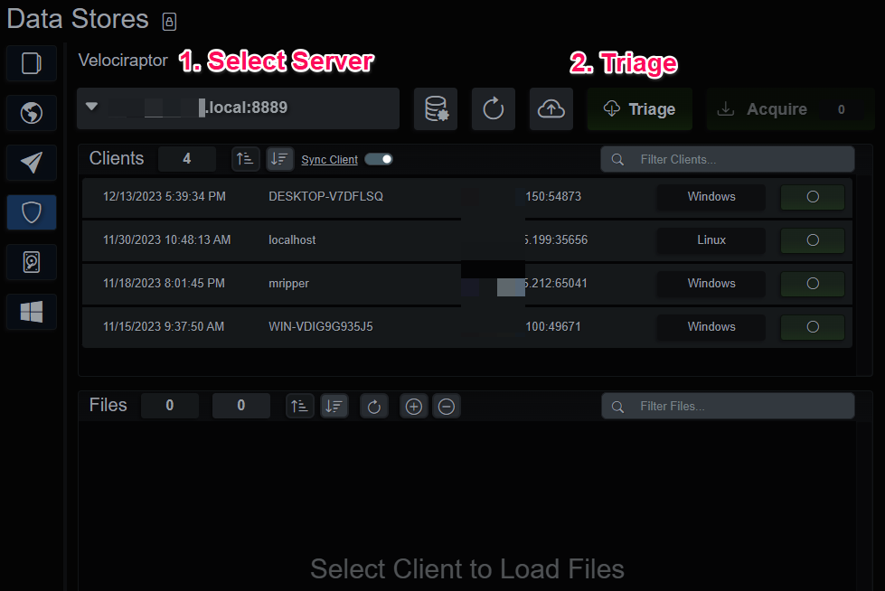
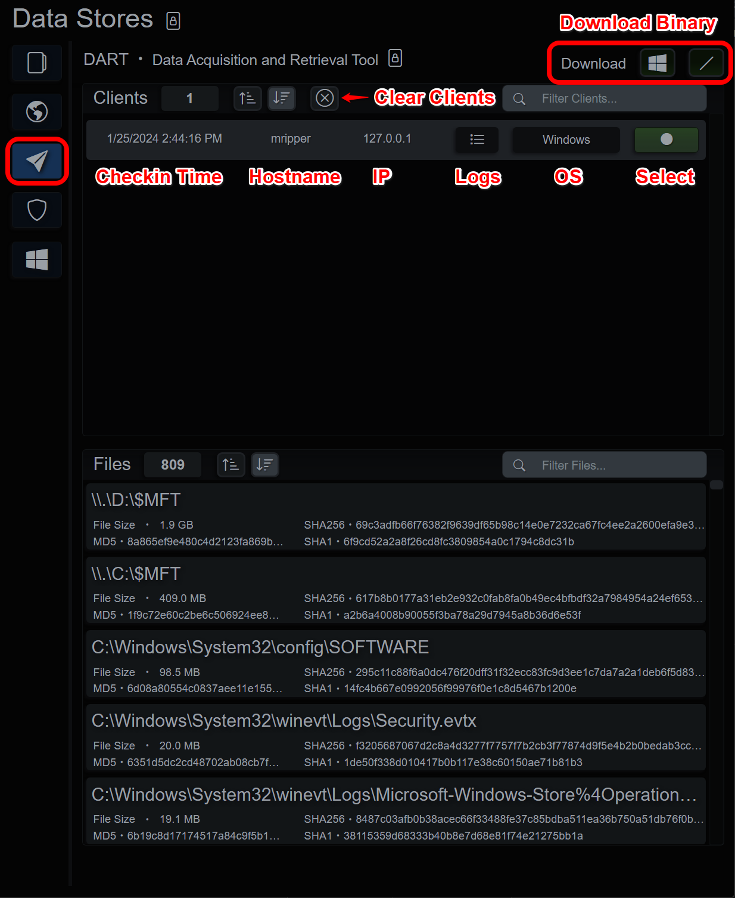
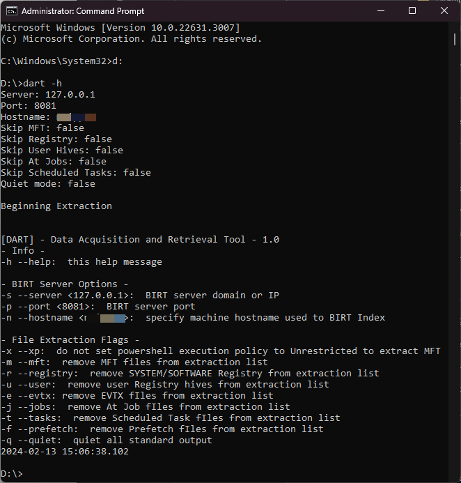
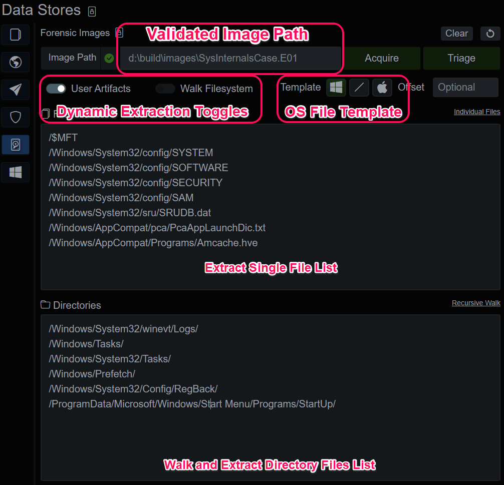
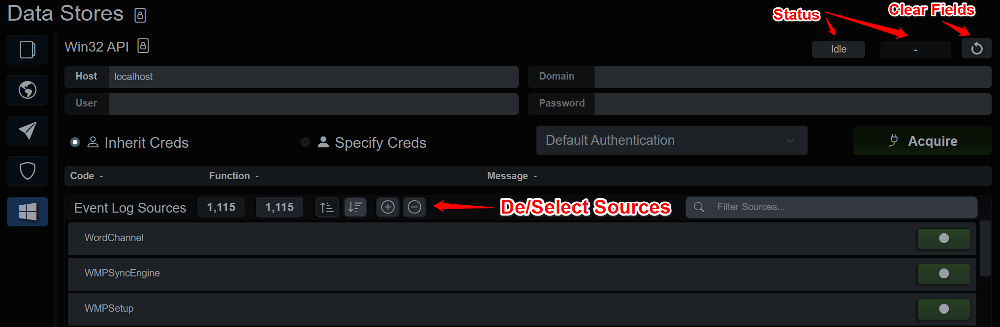
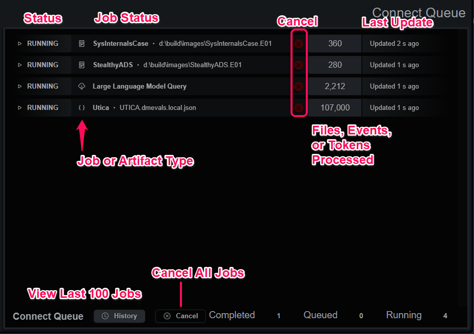

# Endpoint Data
  
[Back](../guide_menu.md)

# Endpoint Data Module

*Endpoint Data*

  

Endpoints are containers for artifact files and the events parsed from them.  Each time artifact files are added to an endpoint, they are parsed into events that are placed into an intermediary timeline.  When all the artifacts have been processed, the endpoint timeline is sorted and indexed during a compile process.  While the endpoint index is compiling, no queries can be made against the endpoint.

Endpoints can be created two ways; manually and automatically.  Manually created endpoints can be added on the main Acquire tab by choosing a name and hitting the Add button.  

This creates an empty container, ready for events and artifacts.  When an endpoint is selected and not busy you can add data in several ways:
- Upload files saved to your local machine.
- Extract files from a Velociraptor server into an endpoint.
- Extract files from a forensic image (.E01, .dd).
- Extract Windows events from a local or remote Win32 API.

Endpoints created automatically come from three sources:
- The Velociraptor integration can also create endpoints with both the Triage and Acquire features.
- DART, the Data Acquisition and Retrieval Tool.  A small utility for Linux/Windows endpoints that extract, packages and uploads artifacts to a BIRT server.
- The python API class included in the install directory can be used to integrate SOAR-like platforms or logic.
  

## Manually Create Endpoint and Upload Files

Endpoints can be manually created.  They require a unique name *per user or data source*.  Endpoints created manually have a Source ID of the 

*Manually add new endpoint*

  

*Manually upload files to endpoint*

  

## Velociraptor
BIRT can selectively acquire individual Clients from a configured Velociraptor server:
- Select a Velociraptor server
- Select a Client
- Select files from the sorted list below the Clients
- Sync Client will automatically create a new endpoint, unselecting it will send artifacts to currently selected endpoint

*Acquire Velociraptor files*

  

A Velociraptor Server can be triaged under certain conditions:
- The Velociraptor server is idle, meaning there are no active jobs on this BIRT instance
- No Velociraptor Client is selected
- The filter/search can narrow the list of triaged endpoints, in case you prefer not to triage the entire server's clients

*Triage Velociraptor server*

  

## DART (Data Acquisition and Retrieval Tool)
DART is a simple command line tool that gathers common artifacts from a Windows or Linux host and uploads them to a BIRT client or server application. When a DART client is finished copying the specified files it will compress and upload them over TLS to BIRT. On check-in the application will create a new endpoint and begin unpacking the files for parsing and analysis. When the unpacking is completed and the files submitted as a job, the client data will show up in the DART UI. It will display the hostname, IP, operating system and check in logs.

*DART Console*

  

Selecting and endpoint will display the metadata for the uploaded files. Clearing the DART history will remove the entry from the DART UI but will not delete the entry from Endpoints. If the parsing job fails or is cancelled, selecting “Force Clear” when clearing the DART history will clean up any files left behind and remove the entry from the UI.

*DART Utility*

  

## Forensic Images
BIRT server and client can access EnCase Expert Witness Compress Format (EWF/.E01) and data/disk duplicator (dd) images of drives or volumes. To get started, select or create a new endpoint for the acquired files and then type/paste the image path into the top bar. If the image is an E01 with additional parts (E02, E03, etc…), provide the path to the E01 and the application will discover the additional parts.
For images of drives with complex partitioning schemes, the application will walk the partitions and prefix the extraction paths with the partition number. Windows and Linux images should be recognized automatically, but an optional offset parameter is included for basic troubleshooting purposes.

The workflow for importing and analyzing an image generally consists of:
- Create or select an endpoint
- Input Image Path to validate that BIRT understands the format
- Select the OS template and add/remove files, paths or toggles
- Acquire the image files, build the index and create MTE evidence
- After files from a forensic image are extracted, the endpoint is associated with that image, and it will auto-populate when the endpoint is selected
- An endpoint with an associated forensic image can be Triaged.
- Triage queries the existing evidence dataset for autoruns and interesting executable files, extracts them from the image and integrates them into the endpoint index data.
- The index will be compiled (again) and the MTE executed on the updated data.

During analysis, the investigator can circle back and extract more file paths or directories manually. It will lock the index while the extraction, compile and MTE execution take place, so batch them up instead of doing one at a time to minimize downtime.

*Forensic Images*

  

## Win32 API
The BIRT client application contains native [EvtQuery](https://learn.microsoft.com/en-us/windows/win32/api/winevt/nf-winevt-evtquery) functionality. This is useful to get a quick view of a remote Windows host without having to pull files from the machine. Credentials are inherited from the client application, by default, however the user can specify credentials and authentication types. After inputting the credentials, press “Acquire” and the Event Log Sources list will populate, allowing the user to modify the selection of sources. Pressing the “Acquire” button again will execute the query and pull the remote event logs and parse them. Any time there are sources listed, pressing Acquire will connect and extract the selected sources into the currently selected endpoint.

*Win32 API Console*

  

## System Activity Queues
Data and artifact parsing or processing tasks are completed in a background job queue.  The current status, an event/file/token counter and a last updated counter represent each job in the queue.  The depth of the queue is limited by the host machine and the license level.   

*Connect Status*

  

  
[Back](../guide_menu.md)