# <span class="center-text">Evidence</span>
<br><br>
[Back](../guide_menu.md)

# The Evidence Module

*Endpoint Evidence Panel*

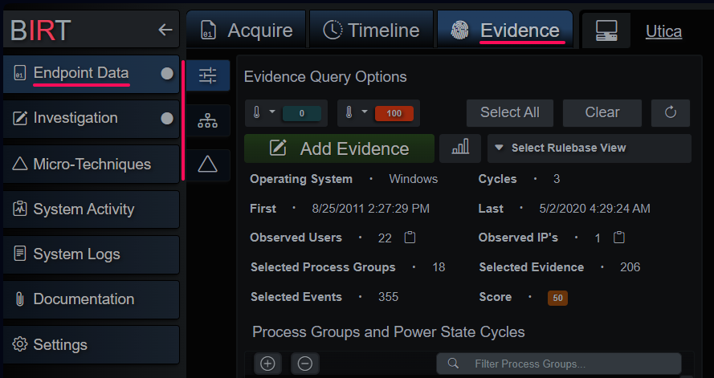
<br><br>


The evidence tab is broken up into three sections: the query + preview section, process tree hierarchy and evidence index. The first tab is where the evidence query is crafted. By default, all process groups from all discovered power state cycles are selected and displayed. The Micro-Technique Engine tracks and infers power state cycles and when an evidence branch is registered it’s assigned to one of many process groups. A process group is a recognizable source for the event(s) in question, e.g. children of C:\windows\explore.exe (that is also a child of C:\windows\system32\userinit.exe) are placed into the Windows GUI process group for that instance of explore.exe. Grouping evidence in this way also groups together similar and related behaviors and is an integral part of an effective filtering strategy.

The most significant Process and Event Groups are:
- Remote Shell - Remote SSHD sessions
- Local Shell - Remote SSHD sessions
- User Branch - User sessions with parent PID of 1
- Service Branch - Service sessions with parent PID of 1
- System Branch - Root sessions with parent PID of 1
- Linux Auditd - Auditd events that don't map to EDR type behavioral events
- Windows GUI - Windows Desktop events per user and session
- WMI Service - Windows WMI service
- Powershell Service - Windows Powershell service
- WinRM Service - Windows WinRM service
- Remote Services - Windows SSH and Telnet
- DCOM Service - Windows DCOM service
- Scheduled Task - Windows Scheduled Task
- Service Host Process - Windows service svchost.exe instance
- Service Executable - Descendants of a services.exe child instance
- OS Process - Operating System structural processes e.g. smss.exe, wininit.exe, etc
- Event Log - Windows XML Event Log events
- Other Artifacts - Catch-all for other non-EDR behavioral type events
- Disconnected - EDR behavioral type event without a definitive process group

Event logs, MFT and Registry files are very verbose. Typically, an investigator is interested in a narrower time range, however it’s always a possibility that interesting activity happened before or after the event(s) that brought them to this point. BIRT gives you the capability of easily pruning the output of the Micro-Technique Engine by deselecting power state cycles and even process groups that might not be interesting or in-scope to the investigation. When these are toggled the process tree hierarchy and evidence index are rebuilt in real-time to dynamically generate evidence and related contextual events.

The top row of the query panel has score range limit selector dropdowns, select all process groups, deselect all process groups and a reload all data button. The next row contains a button to the simplified evidence collection panel, Micro-Technique Engine statistics and the View dropdown. Views are filters created from the Micro-Technique rule base that only show events that are related to the MT’s included in the view. An example is the Command Interpreters view, which only shows events and evidence related to cmd.exe, powershell.exe (and derivatives), bash, sh, etc. By default, there is one for each Tactic and they give the investigator another way to split the dataset during analysis.

*Evidence Query Configuration Panel*

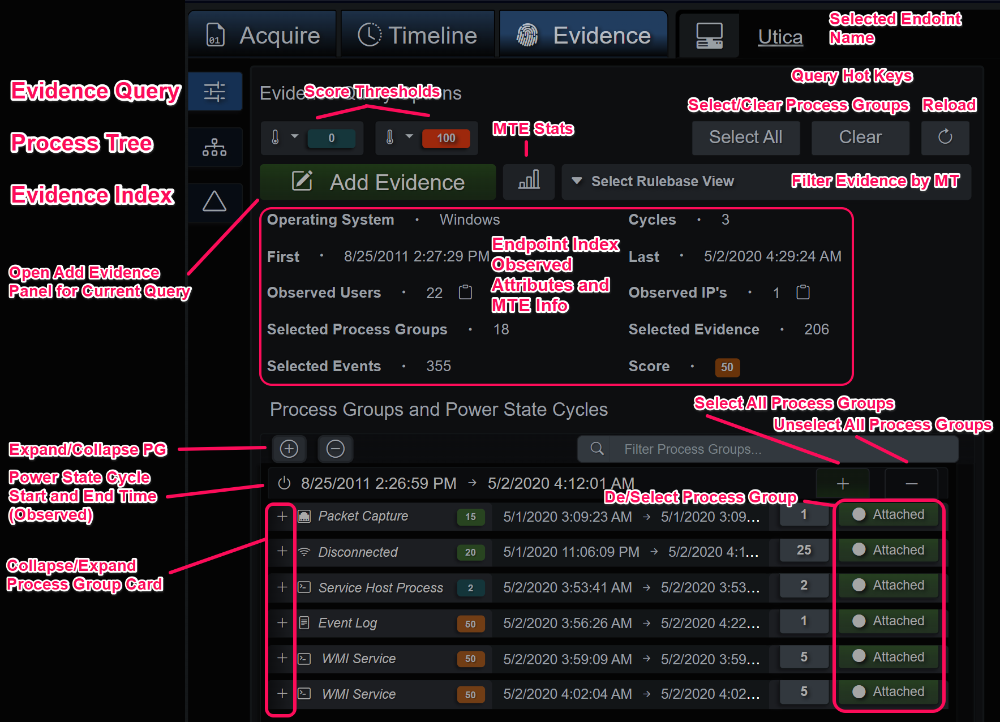
<br><br>

## Evidence Query Summary
The evidence summary is a quick way to recon the selected process groups. It does have some internal limits on amount of returned data, like the process hierarchy tree diagram so it’s not intended to be authoritative for very complex evidence graphs.

*Evidence Summary Panel*

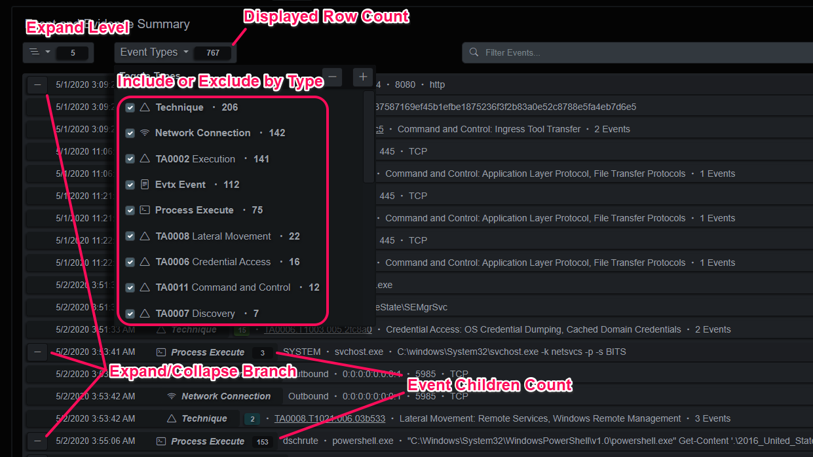
<br><br>

## Add Evidence Panel
The last item of note on the query panel is the Add Evidence panel. When selected it will query all the events and evidence present in the selected process group(s). The user can then prune events with the index to the left or selecting/deselecting events in the main panel. The MITRE evidence to the right will adjust based on the selected events. Pressing the confirm button will merge those events with the currently selected investigation.

*Add Evidence Panel*


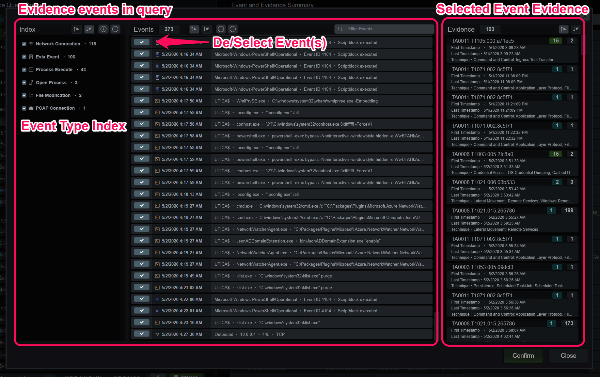
<br><br>

## Process Group Tree Diagram
The process group tree diagram is generated as groups are de/selected. This view is intended to give another angle on evidence that contains EDR/XDR process behavior data. When events are part of the investigation, they will have a green border and when a process is clicked the events and evidence panel will slide out giving the user the ability to add the node/branch to the investigation or analyze the evidence. The diagram can be adjusted with the controls at the top and power state cycles can be selected on the right-side list.

*Process Group Tree Diagram*

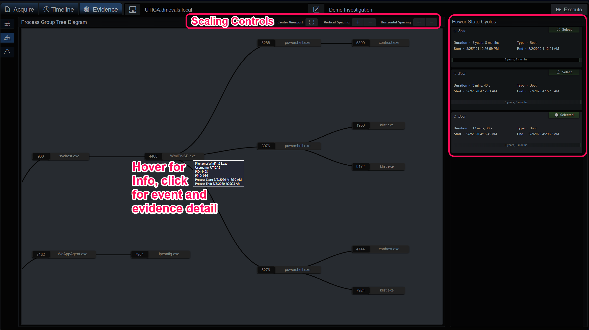
<br><br>

## Evidence and Timeline Index Viewers

The endpoint timeline is a queryable data structure that represents the events in time-logical order. It is composed of a slice of the timeline events on the left side and the index slice on the right. The index slice displays the cardinality (count) of the unique values for each key.  Each value is indexed up to 1024 bytes, any queries beyond that will still match, but only the first 1024 bytes of the query will be matched against the first 1024 bytes of the value.  In the abbreviated example below, the structure of an event is displayed.  Each key's value is compared against the previous values and if a duplicate is discovered, the count is increased.

*Example Process Create Event*

```json
{
  "node_id": "ev-8320f18b2b9a5ead9300000000000500",
  "parent_node_id": "ev-8320f18b2b7b5ead6200000000000500",
  "pid": 3076,
  "ppid": 4468,
  "logon_id": "0x3e7",
  "integrity": "System",
  "user": "NT AUTHORITY\\SYSTEM",
  "session": 0,
  "image": "C:\\Windows\\System32\\WindowsPowerShell\\v1.0\\powershell.exe",
  "filename": "powershell.exe",
  "md5": "CDA48FC75952AD12D99E526D0B6BF70A",
  "sha1": "36C5D12033B2EAF251BAE61C00690FFB17FDDC87",
  "sha256": "908B64B1971A979C7E3E8CE4621945CBA84854CB98D76367B791A6E22B5F6D53",
  "imphash": "A7CEFACDDA74B13CD330390769752481",
  "parent_image": "C:\\Windows\\System32\\wbem\\WmiPrvSE.exe",
  "parent_filename": "WmiPrvSE.exe",
  "parent_command": "C:\\windows\\system32\\wbem\\wmiprvse.exe",
  "command": "powershell -exec bypass -Noninteractive -windowstyle hidden -e WwBTAHk...E0AUwA=",
  "utc": 1588407194.758,
  "orig_event": { },
  "os_string": "WINDOWS",
  "endpoint_hostname": "UTICA.dmevals.local",
  "event_type": "proc",
  "exit_utc": 4294967294,
  "endpoint_id": "70582555974831895",
  "source_file": "UTICA.dmevals.local.json",
  "event_type_class": "edr",
  "uid": -1,
  "auid": -1,
  "extension": "exe"
}
```

The events can be ordered ascending/descending on their UTC timestamps, or the 4 or 8 timestamps provided by the file system abstractions (Windows $MFT and Image File Entries). Index queries can be generated by clicking on a value under its key or using the value’s dropdown for a more specific query. Queries can also be manually entered above the query breadcrumb bar or copy/pasted on the right end.

*Index Viewer Detail*

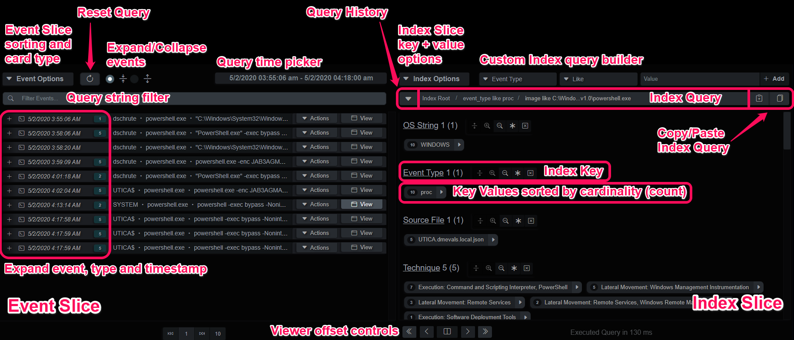
<br><br>

### Index Keys and Values
The index keys and values reflect the normalized event keys and a count of each unique value present in the events that make up the index.  When the index is compiled, this index is built.  A cardinality index is an effective tool for finding anomalies and analyzing datasets of this size and type.  

*Index Slice Keys and Values*

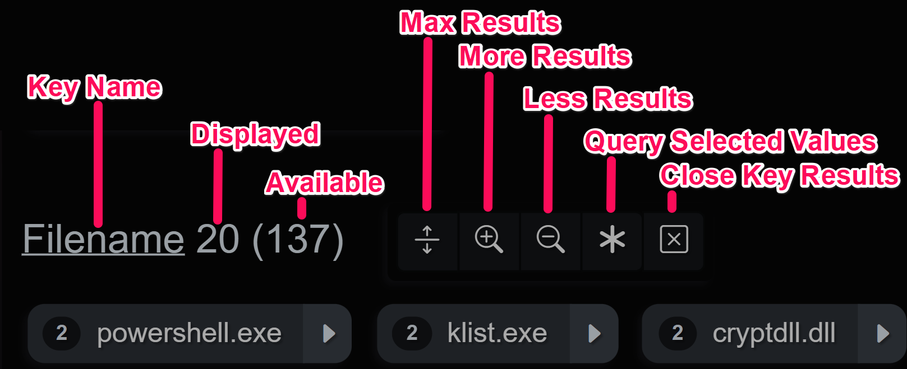
<br><br>


### Slice Options
The event slice can be sorted by timestamp(s) and there is also a toggle for full vs compact event display in the slice panel.

The index slice has hot keys for expanding, closing and resetting the index key's state e.g. open/closed/sort asc/desc/etc.  The keys and values can also be sorted in two or more ways.

*Event and Index Slice Option Menus*

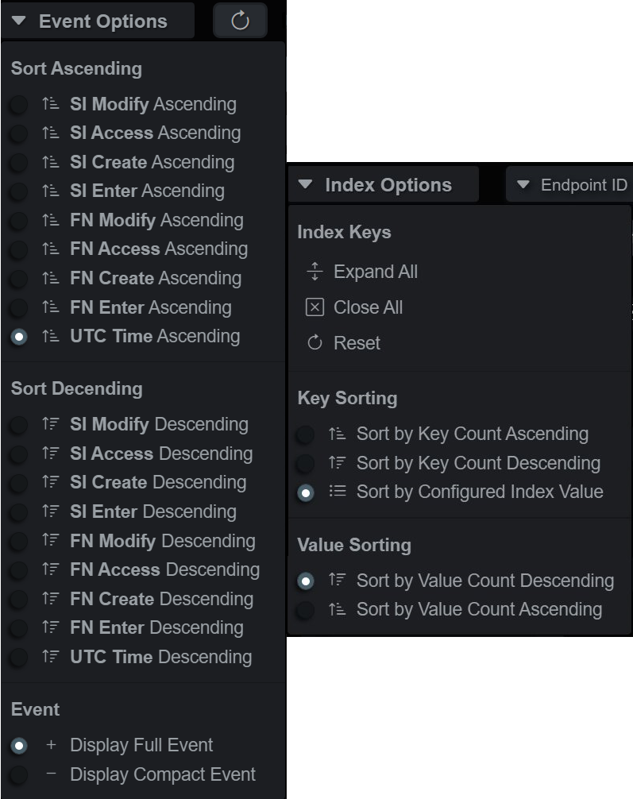
<br><br>

### Index Values
Index values can be queried and added to the active index query, the **Attribute** - **Operator** - **Value** query will display in the bar and the query will be executed.  The default is a LIKE query.  Clicking the dropdown expands a menu of operators that is type-aware, so integers/floats will also allow gt/lt operators, amongst others.

*Index Value Query Shortcut*

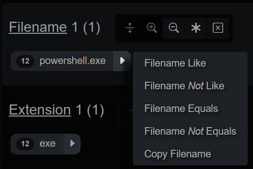
<br><br>

## Actions
Event rows or cards have an actions dropdown menu that displays the available ways to utilize the data in the event.  The dropdown menu is broken down into several sections:

- **Investigation** - Add events by branch or node
- **Event** - Copy event to clipboard and open event viewer panel
- **Timeline** - Modify index query time range around this event's timestamp
- **Hierarchy** - Query for events in the hierarchy or tree
- **Evidence** - View MITRE ATT&CK summaries and MT timeline
- **Large Language Model (LLM)** - Analyze single events or evidence with context

*Timeline Event Actions*

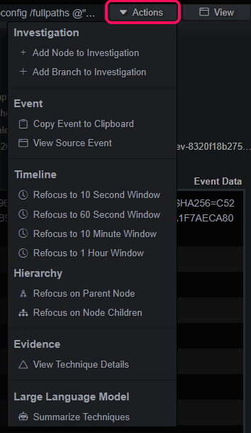
<br><br>

# Strategies

## Highlighter
Carving through large datasets to find the proverbial needle in the haystack usually entails looking at a lot of hay.  In addition to carving the event stream by keys and values, the query string filter can be used to filter events *and* highlight/filter the displayed event keys.  The following example demonstrates a string filter for "ScriptBlockText" with the event card expanded, this is useful for analyzing Powershell events.  

*Filter on Event Keys*

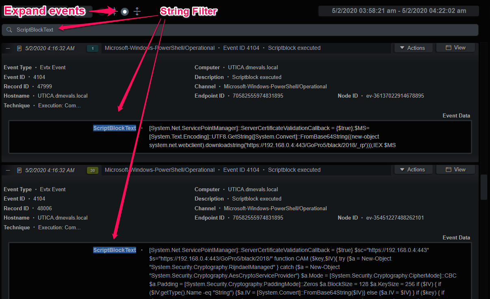
<br><br>

## Narrow Timeline Analysis
Another useful analysis pattern is to use the much smaller Evidence timeline to generate queries for the endpoint timeline.  Oftentimes malicious activity can be narrowed down to a smaller time range.  Using the Evidence index viewer, the analyst can set a narrow time range with the time picker or the Actions -> Timeline query and make any adjustments, as necessary.  That index query should now appear in the Query History and can be selected in the endpoint Timeline index viewer, giving a unabridged view into the endpoint during that time period.

*Narrow Time Range Analysis*

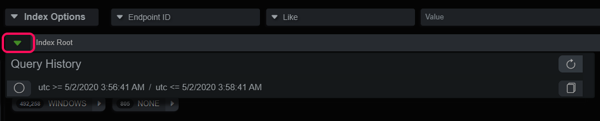
<br><br>

## Parent/Child Hierarchies
Many of the artifacts BIRT recognizes are parsed into events that have parent/child relationships:
- EDR events have parent ID's that reference the process responsible for the activity
- $MFT entries have a parent ID of the directory they're in
- Image File entries have a parent ID of the directory they're in
- Windows registry Keys have a parent ID of the next-level up Key
- Files extracted from PCAP or other files have a parent ID of the connection or file

Under the event Action menu there is a section labelled Hierarchy where an analyst can walk the relationships with queries up or down the tree by parent node or child nodes.  For example, if I'm interested in a certain process and its activities, I can select "Focus on Node Children" and the query will return the child processes, file/registry/network/etc actions for that process.
<br><br>

## Manually Executing the Micro-Technique Engine
During analysis and investigator might make adjustments to Micro-Technique rules or modify the Investigation indicator strings or regexes.  The Execute button in the upper right-hand corner can be used to manually run the engine.  This locks the index for all users and shows a progress bar at the top of the Data Stores panel, as well as on the System Activity tab.

This will delete and rebuild the evidence graphs and the Evidence tab will repopulate when the process has been completed.  Th

*Execute MTE*

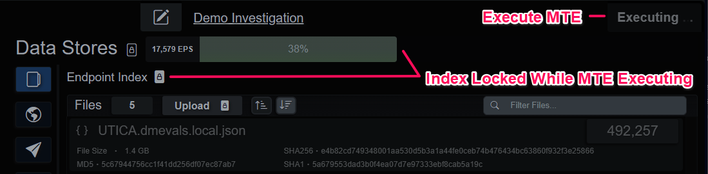
<br><br>

## Using LLMs
Events from the endpoint timeline or evidence can be analyzed by an LLM from the menu found in the Actions dropdown.  The API prompt is adaptive, and in the case of labelled evidence, it will gather contextual information to enrich the analysis, with more enhancements coming with every update.  Better results have been observed with higher parameter count models.

*LLM Evidence Analysis*

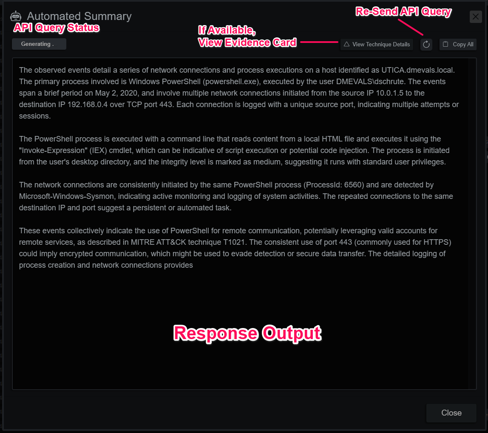
<br><br>

<br><br>
[Back](../guide_menu.md)