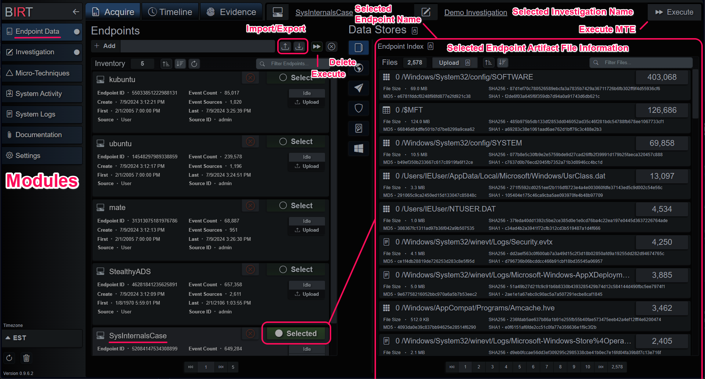
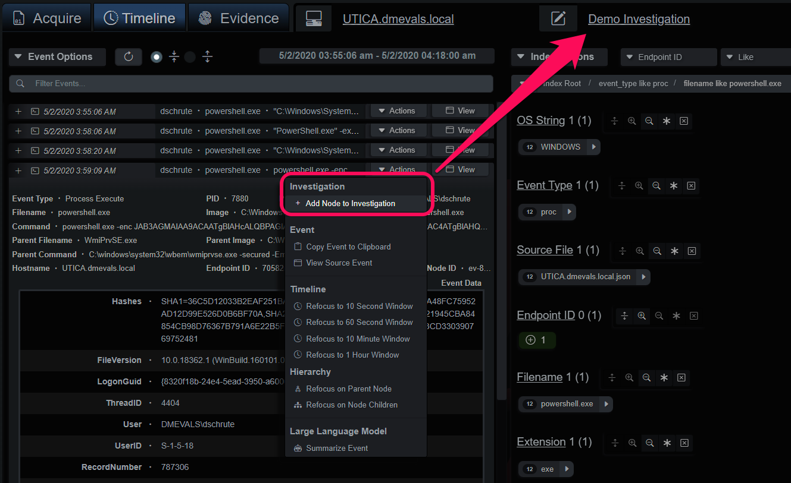

# <span class="center-text">Getting Started</span>
<br><br>
[Back](../guide_menu.md)

This document is intended to serve as a primer on basic capabilities and terminology used throughout the documentation and guides.


# Windows Installation
Download the installer exe from [The BIRT Project](https://www.thebirtproject.com) and run it.  The installer will request admin permissions for installation, the default install path is in Program Files.

*Windows Installer*


<br><br>


The installer will optionally create desktop shortcuts and start the application.

*Windows Installer Options*


<br><br>

Two shortcuts will be created.  The primary "BIRT" launcher will start the service and open the UI URL in a browser window.  The shortcut labelled "BIRT Demo GUI" will launch a self-contained application with a QT GUI.  The QT GUI is deprecated and will be removed from future releases.

*Windows Launcher*


<br><br>

# Docker Install
The application is hosted on Docker Hub:
```shell
user@localhost:~$ docker pull thebirtproject/birt-beta:0.9.6.2

user@localhost:~$ docker run -it -p 127.0.0.1:8080:8080 -p 127.0.0.1:8081:8081 thebirtproject/birt-beta:0.9.6.2
```
Open a browser to https://127.0.0.1/ui/ to access the application UI and login with admin/admin.
<br><br>

# Application Layout
BIRT is composed of several primary modules:
- Endpoint Data: Acquire Data, Analyze Evidence and Timelines.
- Investigation: Curate and Manage Investigations.
- Micro-Techniques: Create Rules, Lists and Views.
<br><br>

## Endpoint Data

*Endpoint Data*


<br><br>

### Data
Data is organized into endpoints, each a container of artifact files and events.  Each endpoint has a unique ID calculated from the name and how the endpoint was created.  When files are added to an endpoint, a few things happen:
- Each file type is identified.
- Each file is routed to the correct parser and events added to an intermediary timeline.
- When parsing has finished, the index compiles; the data is sorted, and the cardinality index is built.
- After the endpoint has compiled the Micro-Technique Engine is run and evidence graphs are populated.

Data can be imported locally with:
- Artifact files on the local machine.
- Forensic images of drives in .E01 or .dd formats.
- Local Windows XML Event Logs.

Data can be imported from remote systems with:
- Velociraptor servers.
- DART tool included with BIRT.
- Remote Windows XML Event Logs.

*Data Stores and Sources*


<br><br>

## Evidence
The Micro-Technique Engine produces evidence organized into a series of power state cycles and process groups with additional machine state information created from observing the event stream.  Each endpoint has an unabridged timeline of events that can be analyzed with the index viewer as well as an evidence view.

The evidence views display the events as a tree/hierarchy, process hierarchy and another index viewer.  Each evidence event contains contextual information captured when the event(s) matched as well as the timeline of events that lead to the detection.  The evidence is organized by process group and power state cycle to produce a set of queryable groups of activity.  The evidence and events are updated in real-time, allowing an investigator to interrogate a dataset from many different angles.

*Evidence Query with Preview*


<br><br>

Evidence can be added from the endpoint Timeline or Evidence tabs.  Each event has an Actions dropdown menu divided into sections with the first section reserved for adding events and evidence to an Investigation.  Under the Timeline tab, single events can be added to the Investigation.  The Evidence tab allows entire branches to be added, as well, due to the endpoint reconstruction data.  

*Add Timeline Event Node to Investigation*


<br><br>

Adding a branch under the Evidence tab will bring up a panel that allows the investigator to choose the events that will be added to the Investigation.

*Add Evidence Branch to Investigation*


<br><br>

## Investigations
The Investigation is an automated container for evidence, events, and analysis summaries.  When events or evidence are added to the Investigation they're added to the appropriate endpoint and integrated with the existing process hierarchy, if any.

The center panel displays the currently selected view into the Investigation events and evidence.  Surrounding this panel are various tools.  To the left is a mini-index of event and evidence types, unchecking a box will filter it from the viewer.  The top-most row contains filters based on score and time ranges.  The row of tools next to the search box displays IOC summaries, endpoint summaries and offer various methods to import/export the data.

*Investigation Tools*


<br><br>

The Investigation produces a series of timelines each time it's updated with new events, analysis comments or summaries:
- Endpoint timelines and hierarchies; individual views into endpoint evidence.
- Global Timeline; the default and most detailed view.
- Evidence Summary Timeline; a linear timeline that focuses on evidence.  Good for lateral movement and high-level overviews.
- Investigation Report; a configurable reporting template that can be exported as a PDF. 

*Investigation Timelines*


<br><br>

## Micro-Techniques
Each MT rule is a finite state machine where each state must match certain conditions before progressing to the next state or closing when all states have matched or expires. MTs were designed to express any concept or scenario possible on an endpoint, without exception, and capture evidence and contextual data that makes big-picture pattern recognition easier.  You can also think of MT as evidence collectors that build mini timelines for very specific events.  When they are combined, as in the Evidence tab, they create a descriptive narrative of behaviors on the endpoint.  When they're added to an Investigation, they provide context and structure that amplifies the effectiveness of LLM's when doing automated summaries.

The Micro-Technique editor displays a hierarchy based on the MITRE ATT&CK matrix on the left-hand side and the currently selected MT in the editor on the right.  The buttons above the list open additional content controls for Views, MT, Lists and the content update service, Cloud Sync. 

*Micro-Technique Editor Components*


<br><br>

The rule editor is comprised of some basic controls in the upper right corner, a rule header section and the list of rule state conditions.  Modifying base content rules is a Copy-On-Write operation, so saving changes to a default rule will disable the rule and make a new copy.

The specifics of rule creation are in the [Micro Techniques](./micro_techniques.md) section.  Designing MT can range from a simple command line artifact to multiple events from different data sources, for example if wanted to find evidence for a malware type dropper we could build states that match on:
- $MFT entry for an executable written in a temp directory
- Windows Registry service key created with an ImagePath value that includes the $MFT filename
- Process creation event with the same filename

This rule would need to be optimized quite a bit to be effective, but it serves as an effective example for the types of cross-artifact correlation that can be done with 

*Micro-Technique Rule Editor*


<br><br>

<br><br>
[Back](../guide_menu.md)