# Investigations
  

[Back](../guide_menu.md)

# The Investigation Module
Evidence discovered and added from the endpoint timeline, or the Micro-Technique Evidence section ends up in the currently selected investigation. The investigation is a living document and object. It contains metadata for each host that has contributed events, evidence and the events in a relational graph. Every new event added to the investigation recalculates the graph relations and updates the UI. 

*Investigation Panel*

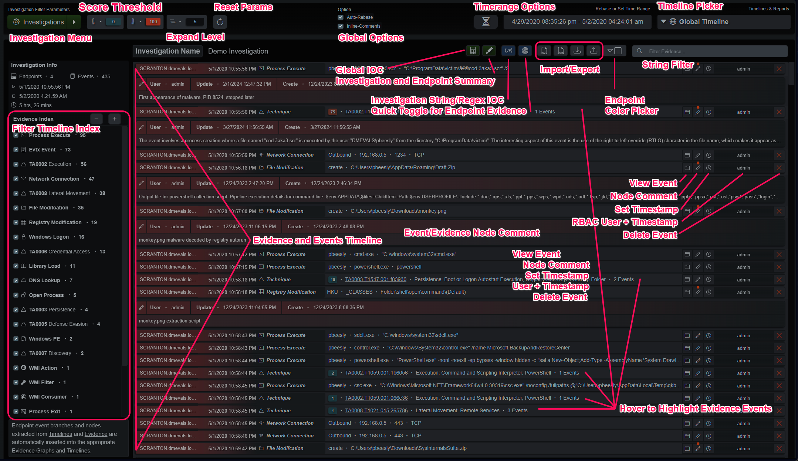

*Investigation Timeline and Report Dropdown Menu*

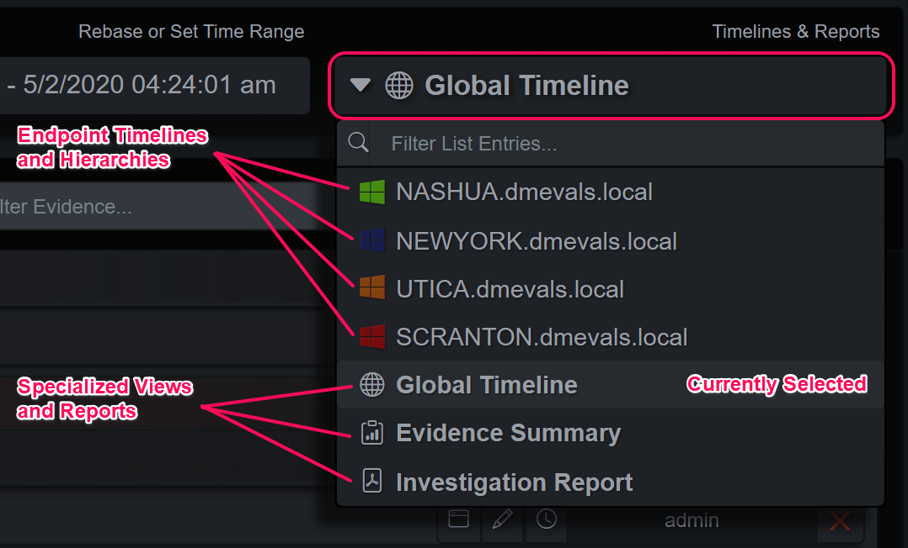
  

## The Global Timeline View
The default investigation view is the Global Timeline view. This contains all the endpoints and events in ordered by the timestamp in ascending order, least recent first. Each event is represented as a row that displays curated information from the event or evidence. Hovering over an evidence event will highlight the events involved in blue. The columns at the end allow the analyst to view each event, add or modify comments and modify the detected timestamp. It also shows the user that added the event and when the mouse pointer is hovered over the username it displays the import timestamp. The delete button is at the very end and will display a panel that allows the analyst to selectively delete events from that graph branch.
  

## Investigation Toolbars
Surrounding the timeline are filtering tools that allow different views into the dataset. The evidence index on the left side shows statistical information and enables filtering by types. The top row contains a button that opens the investigation selection panel as well as a quick dropdown that allows selection of the most recent 10 investigations. Next to that are score min/max threshold dropdowns, a tree expand limit dropdown and a refresh button. The middle option contains two toggles for rebasing the time range and including inline comments in the timelines. 

The rebase toggle, when selected, will automatically update the time picker range when new events are added. If a user is looking at specific time ranges and analyzing the investigation, it could be disturbing to have the time picker reset their narrower time range if another analyst is adding new events to the investigation. At the end of the row is a manual rebase button for the time range, the time picker itself and the dropdown to select which representation of the evidence is being displayed.

*Investigation Menu*

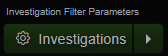

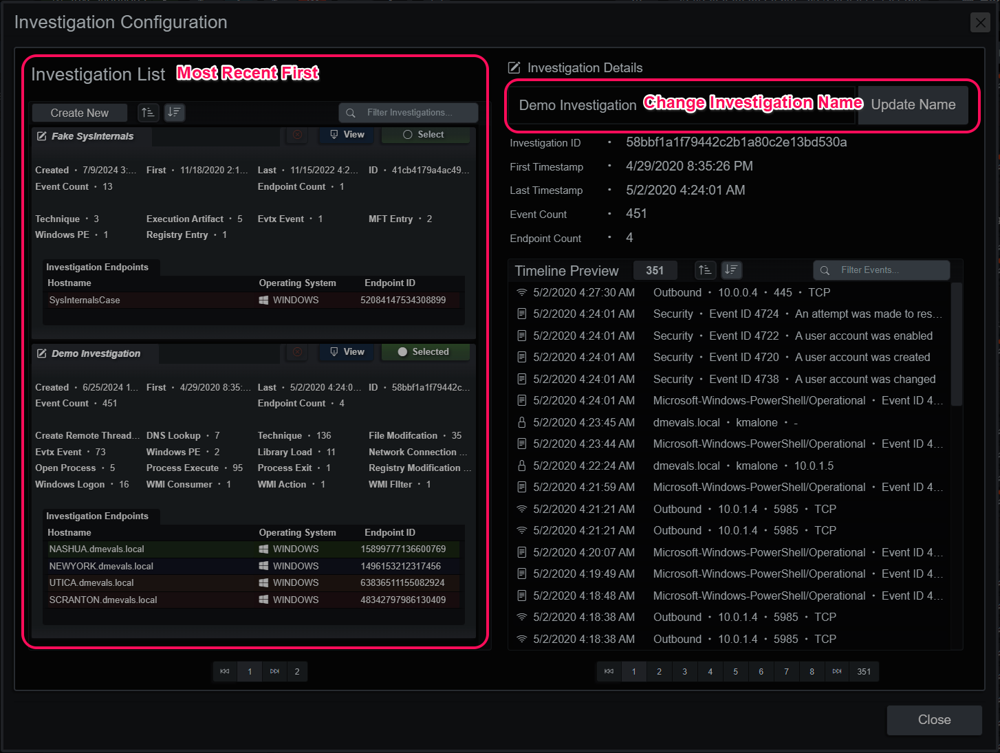
  

## Investigation Indicators
The investigation indicators button displays a panel used to attach string and regular expression indicators to the current investigation. When these indicators are present and selected, the user executed Micro-Technique Engine analysis will attempt to match these string/regexes against every value in every event. Evidence generated will indicate if it’s a string or regex match and the sub-technique will point to the list index of the matching string/regex.  For example TA9999.T9991.001.cd2f7a indicates a string match (T9991) on the second entry (.001) of the list of strings.  A regex match would be T9992 and the sub-technique slot indicates the list index, as well.

*Investigation Indicators*

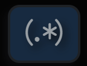

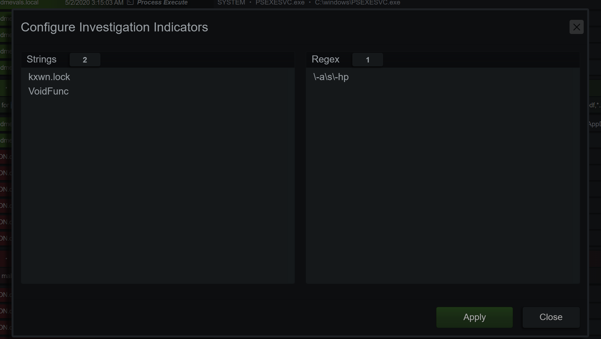
  

## Investigation Node Comments + LLM
Comments on events can be added/deleted/modified and display the last user to modify the entry. Formatting is kept in the display panel but flattened in the timeline rows. The green button at the bottom of the panel generates a comment using an LLM. If the selected node is an event, the comment is generated from that single event. If it’s a Micro-Technique evidence event, the events, Technique and Sub-Technique are considered when generating the comment.

*Investigation Node Comments*

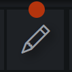

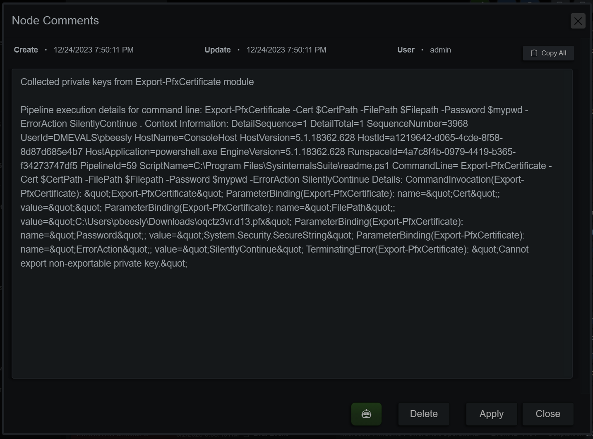
  

## Set a Manual Timestamp
Sometimes timestamps on events don’t quite line up with others from the various event sources. An example is PowerShell EDR/XDR events and the PowerShell ScriptBlock Logging timestamps, which usually log several seconds after the process event. Analysts can manually adjust timestamps with a string typed in that will be interpreted in the time zone selected in the application or manually from an event with multiple timestamps such as the Windows MFT.

*Investigation Manual Timestamp*

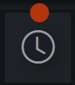

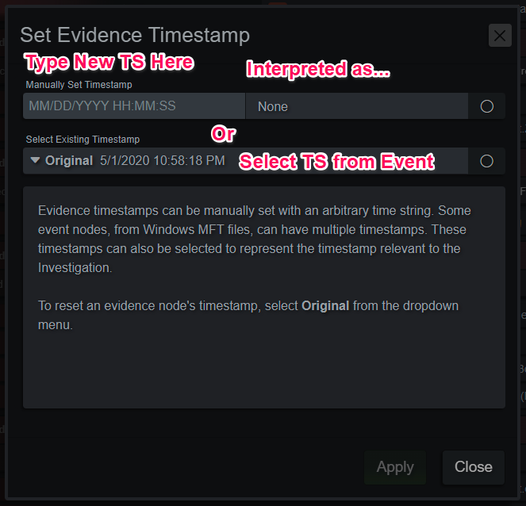
  

## Investigation Endpoint View
In addition to the Global Timeline view, the analyst can also view individual hosts in the current investigation. Selecting a host from the dropdown menu in the upper right corner offers a few more options such as changing the endpoint’s UI color, viewing as a Tree or Timeline and deleting the endpoint from the investigation. 

*Investigation Endpoint View*

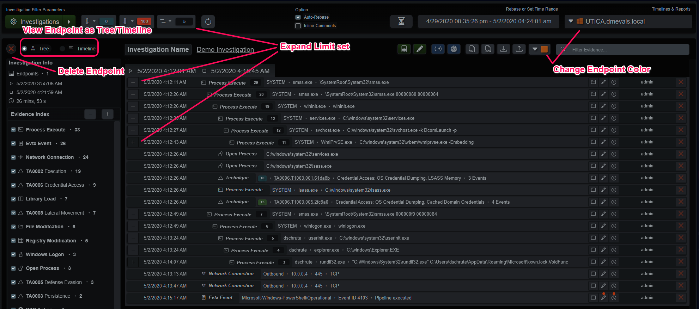
  

## Investigation Evidence Summary View
The evidence summary view is useful for higher-level evidence-focused analysis. It’s exceptional for highlighting remote access/lateral movement. Evidence is the primary container for events in this view, instead of the other way around. If the summary is too noisy, adjust the score thresholds, specifically the minimum score threshold above 1, to hide the informational evidence and only show more risky behaviors.

*Investigation Evidence Summary*

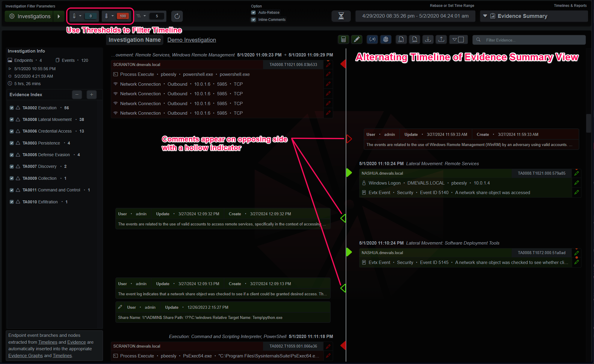
  

## Investigation Reporting
The final section of the Investigation panel is the reporting section. The investigation can be distilled into a PDF report with details, notes and comments that can be distributed amongst analysts and stakeholders. The report can be verbose or truncated, as required. In addition to the options to the right of the report preview, the investigation index and string filter will also modify the report in real-time for further trimming, if necessary.

*Investigation Report*

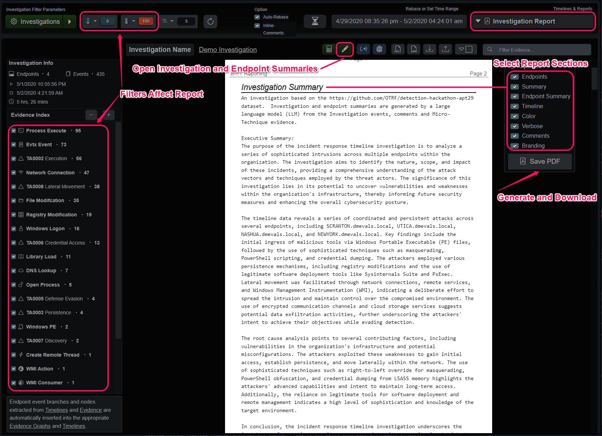
  

The green pencil icon at the top of the main panel opens the Investigation Summary panel.  There is an entry for the investigation itself as well as one for each endpoint.  After modifying an entry, the save button will highlight in green, if you switch to another entry the changes will be lost.

*Investigation Summary*

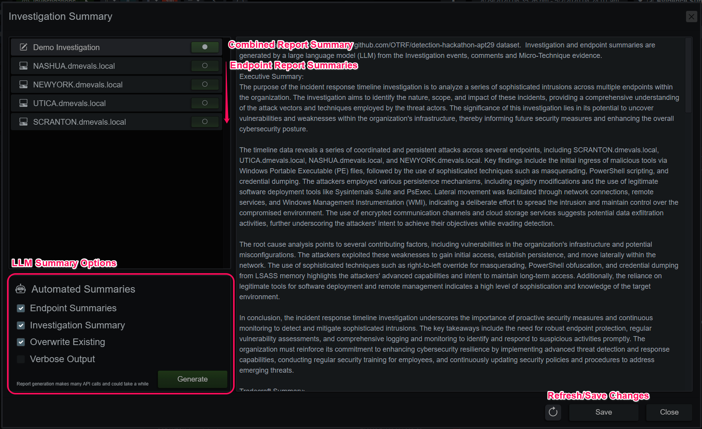
  

## Automated Investigation Report Generation
If a large language model (LLM) is configured, summaries for the endpoints and the Investigation can be automatically generated and applied. These sections are selectable items in the Investigation Report and can be included or pruned when generating a report file. When the request is generated from the Investigation Summary panel, a job is created on the server. The LLM is queried by a series of personas, each with their own duties and lens to view the timeline data and report their findings. The findings are combined and applied to the Investigation and endpoints, as configured.

These reporting personas are very thorough, and to get as much out of each query as possible, models with a higher context length often perform better than models with higher parameter counts and lower context length. Think of the context length of the model as its short-term memory/attention span. Any query beyond that window either throws an API error or has the query truncated with various strategies. To avoid encountering even more non-deterministic behavior with an LLM, all queries are pruned to fit within half of the configured context window.  With the other half budgeted for the response.  If we fill up the entire context window with our prompt + query, the agent uses various strategies to still produce output with varying side effects.  The most common in open-weight models is repeating until the query times out.
  

## LLM Considerations
To get the best results from a generated report, annotate the events and evidence with definitive information about the behaviors.  By default, contextual data from the MITRE ATT&CK detections is added to the prompt, but comments on the data add to that context and builds a better report.  Every event in the report is considered by the model (depending on token context-length limits), so pruning unnecessary nodes and evidence can prevent the model from going down rabbit holes in report narration.

The demo Investigation distributed with the application contains 4 endpoints and roughly 450 events + comments, Mistral AI’s Mixtral Instruct 8x7b MoE with its context length of 32,768 tokens is a good fit for this size Investigation. It minimally prunes some lower scored evidence to fit the timelines and the instructions into that token budget and produces a good start. ChatGPT's 4o model with its 128,000 token context window can report on the Investigation without truncating any events with very good output quality and reproducibility. All these observations on quality are a snapshot in time and with the technology advancing so fast, it’s encouraged to test your configured LLM on an investigation or dataset you’re familiar with to evaluate the output.  This is the third time this evaluation of model's has changed in the past 6 months.

Report generation can take several minutes or more, depending on the API server's performance.  The Connect Queue entry in the System Activity tab counts the amount of tokens received by the API server.

  
[Back](../guide_menu.md)

