# <span class="center-text">Micro-Techniques</span>
<br><br>
[Back](../guide_menu.md)

# Micro-Technique Configuration Module

*Micro-Technique Panel*

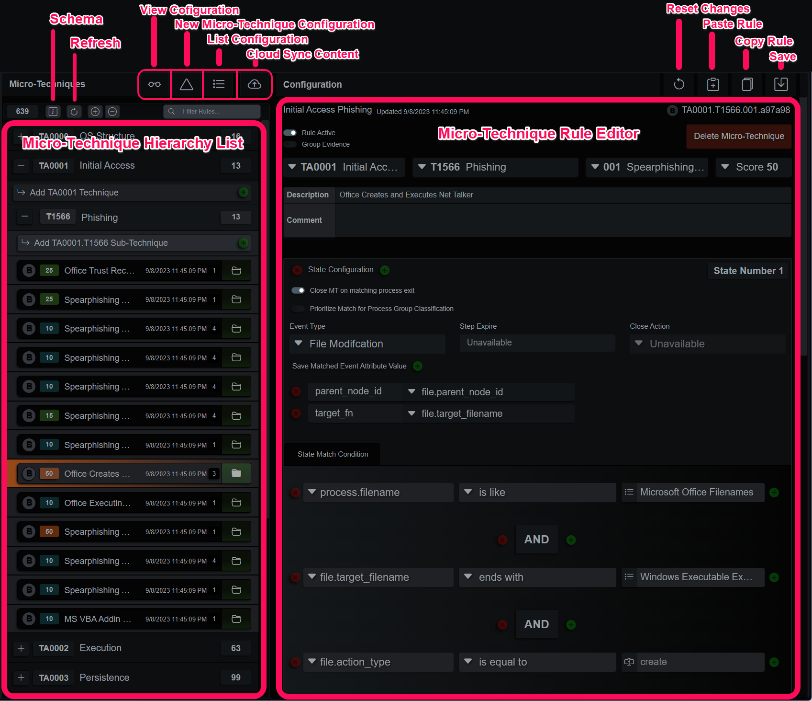
<br><br>

This panel is where Micro-Techniques, Views and Lists are configured and maintained. The ribbon menu at the top left expands configuration panels and beneath those buttons is the rule base organized as a hierarchy, Tactic, Technique, Sub-Technique and individual rules. The ribbon menu to the right operates on the currently selected rule, which is displayed below it.


## Micro-Technique Overview
Each MT rule is a finite state machine where each state must match certain conditions before progressing to the next state or closing when all states have matched. MTs were designed to express any concept or scenario possible on an endpoint, without exception, and capture evidence and contextual data that makes big-picture pattern recognition easier. The Micro-Technique Engine (MTE) organizes, executes and collects evidence from rule matches to create the evidence graph. In addition, as it observes each event it updates a reconstruction of the endpoint’s state.

*Micro-Technique Engine Workflow*

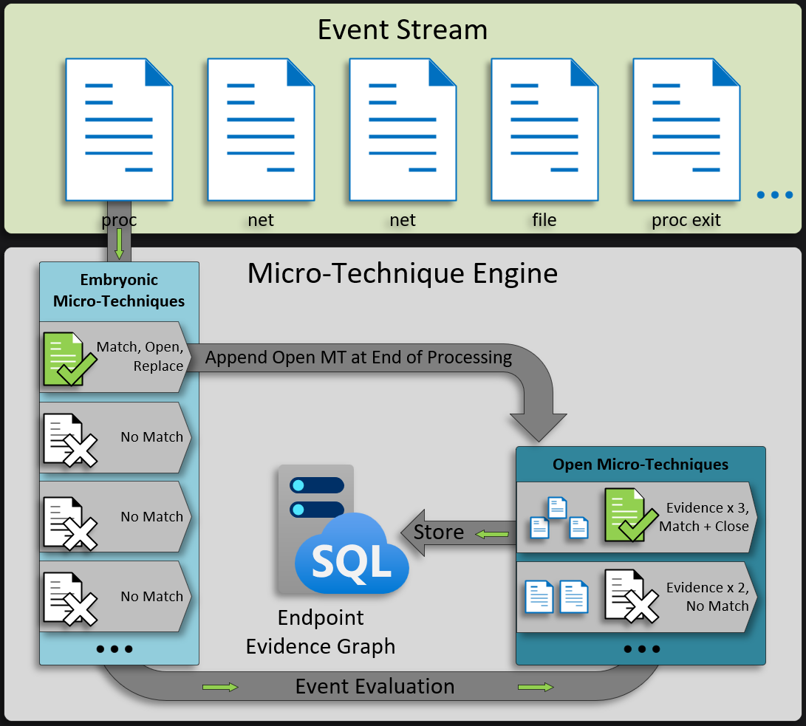
<br><br>


## Event Evaluation
When the MTE initializes, a copy of each MT rule is loaded in an embryonic state. During the evaluation phase, the endpoint index provides events, one at a time in time-logical order, into the MTE. Each embryonic MT is assessed for a potential match against the event’s keys and values. When the current state matches and the Micro-Technique has more states left, the MT stays open and active. If the current state is the last state and it doesn’t have any close actions, MT transitions to closed. In the case of an open state, the Micro-Technique object is preserved, and a new embryonic Micro-Technique of the same type takes its place for processing the next event. Closed Micro-Techniques record the events, evidence, and contextual data for the ongoing construction of the evidence graph.
<br><br>

## Open Micro-Technique Evaluation
Once the event has been evaluated by the embryonic MTs, the previously open and active MTs are assessed against the event and removed if closed. The MTE has a limit of 4096 open MTs at any onetime, new MT over the limit are dropped and a counter in the stats is incremented. The last action the MTE takes for each event is merging any new open Micro-Techniques objects with the existing group of open and active Micro-Techniques.
<br><br>

## Micro-Technique Matches
When an MT state matches an event, it triggers the state transition logic. The user-configurable portion of this process instructs the MT to capture values from the triggering event. The values can be used to compare against later events, enabling a related chain of events to be matched and extracted from the event stream. The events do not have to be of a similar event type or class, MFT event values can be matched against EDR/XDR process creation events, for example. Complex scenarios can be described in MT states that were not possible with previous detection engines.

There are also built-in functions that can execute in place of a standard comparison operation, for example a matched process can then be queried to see if it belongs to a previously observed shell session based on event specific attributes, like session ID and username.
<br><br>

## Micro-Technique Configuration
*Micro-Technique Layout*

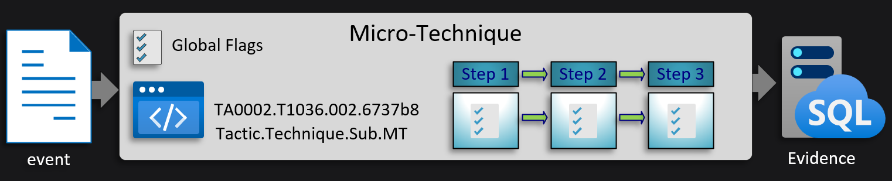
<br><br>

## Flags
MT states, at a minimum, require an event type and a single condition. There are several other flags and options that will affect overall behavior. These flags can be declared globally or from within each state. 

*Micro-Technique Flags*

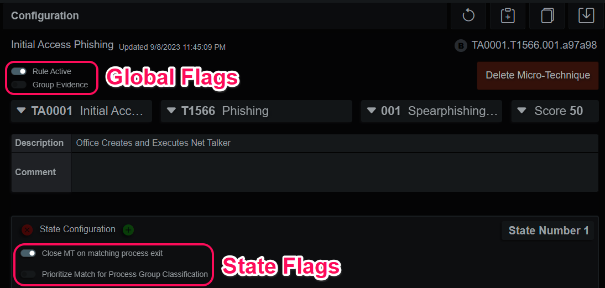
<br><br>

The global option “Group Evidence” is useful for repetitive detections. For example, we can be interested in a process connecting to an Internet server on TCP port 443, but we don't want thousands of individual network evidence entries polluting the evidence graph. This option binds further detections to the process responsible (event parent node ID if it matches a non-process event).


The example logic just explored can go beyond processes creating files, registry entries or network connections. The Windows MFT and Registry are linked forward and backward, as well. In the MFT files have a parent of the directory and directories have a parent of the directory they reside in. The Registry is similar, values have a parent of their key, and keys have a parent of their key or hive. Each MT object stores the first 55 evidence events, but it will continue to count subsequent matches.


Selecting “Close MT on matching process exit” instructs the MTE to close the MT without registering evidence if this matching process exits before the other states can match. The “Prioritize Match for Process Group Classification” instructs the MTE to choose this matching process (event parent node ID for a non-process event) as the candidate when determining the matching process group. This is commonly used on a Windows machine when a user initiates an action in their session and a child process or action occurs in the service session (DCOM), or another entirely. It doesn't have to be due to session mismatches exclusively; this was a convenient example.
<br><br>

## State Expire and Reset
MT states after the first allow for expiration of the step. This closes the open MT without registering evidence and is used as an optimization step and to add constraints to operations that are only valid for a time range. The MT can be configured to execute an action when it normally would close, resetting the last state and continuing to attempt to match its configured conditions. The MT will continue to collect evidence that matches the last state and update the evidence entry in the graph.

*Micro-Technique State Expire and Reset*

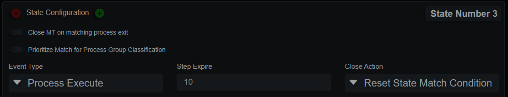
<br><br>

MT States can also capture arbitrary values from a matching event with the “Save Matched Event Attribute Value” key/value pairs. The values can then be compared against in subsequent state match conditions. They don’t have to be from the same event type or source. An MFT filename can be compared to a process parent filename, for example. 

*Micro-Technique Capture Value*

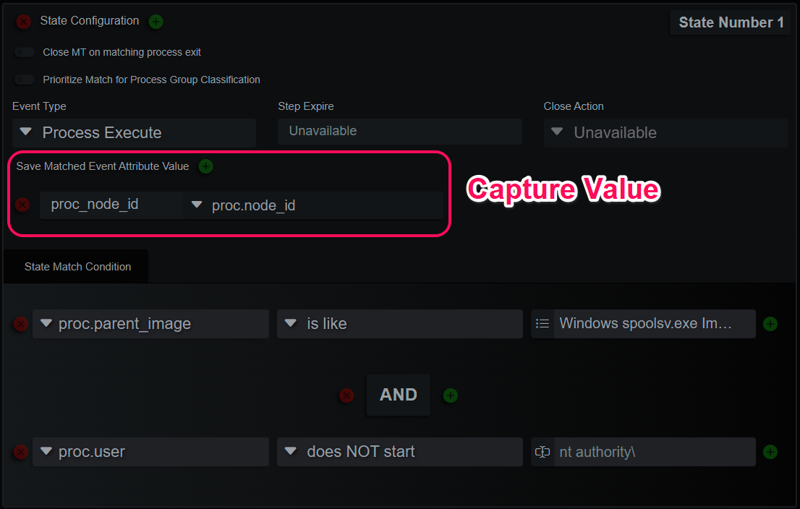
<br><br>

State match conditions can be nested with precedence groups and generally follow **Attribute** - **Operator** - **Value**, an example in a SQL-like language:
```sql
(
    (
        proc.filename LIKE 'explorer.exe'
    )
    AND
    (
        proc.parent_filename LIKE 'userinit.exe'
    )
)
```

This has two nested queries and follows the **Attribute** - **Operator** - **Value** pattern. The Value can also be a callback value from a previously saved state attribute, it can also be a check if an IP is private, public or one of either. Currently, there is a single RPG callback function that will find if the current process is related to the GUI instance of explorer.exe. This can answer the question “Is this a GUI process?” in a more efficient way than exhaustively covering scenarios with unique MTs.
<br><br>

# Lists
*Micro-Technique Lists*

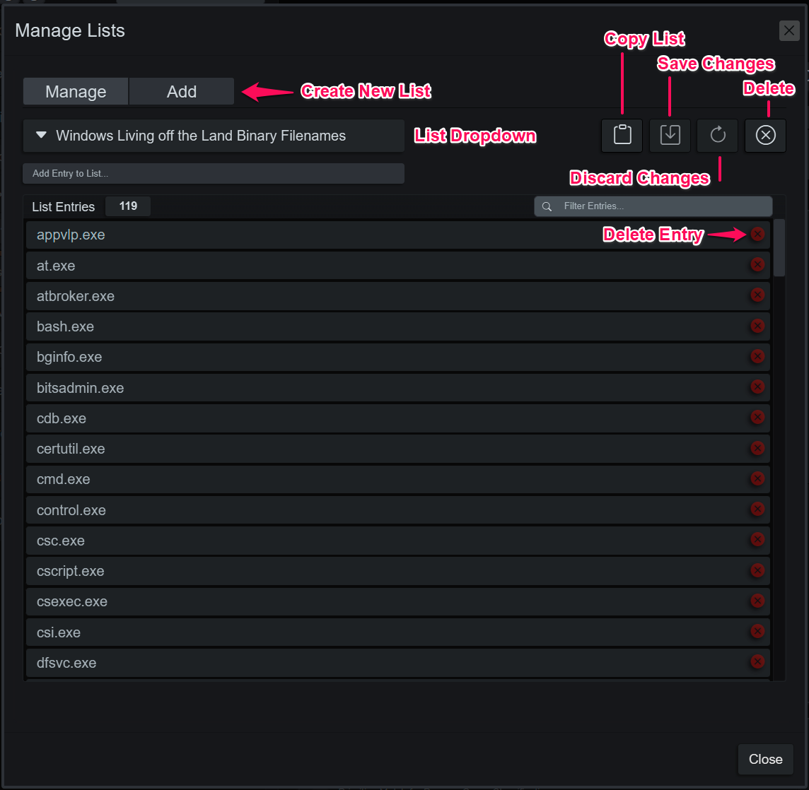
<br><br>

MTs leverage lists to organize collections of related indicators. For example, a list of common Windows paths can be created to filter some logic and another list of string indicators that imply malicious intent could also be created for the opposite purpose. The lists have several optimizations so large instances, thousands of entries, won’t affect performance more or less than a small list, O(1)
<br><br>

# Views
*Micro-Technique Views*

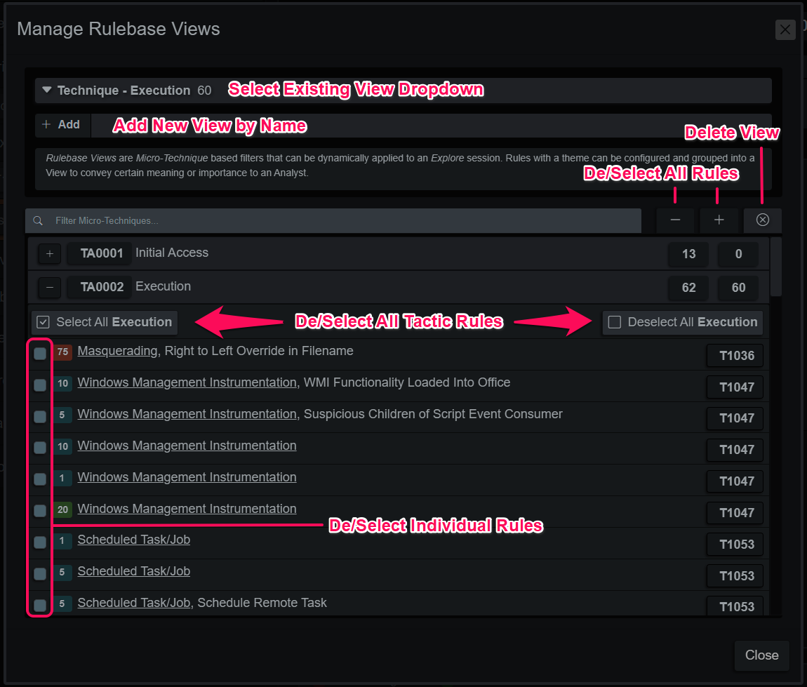
<br><br>

Each View is an exclusive filter of Micro-Technique ID’s that can be applied when loading endpoint evidence. Examples for usage include MITRE Tactics for focusing on a critical portion of a complex intrusion or a view for command interpreter shells to pay closer attention to executed system commands.
<br><br>

# Cloud Sync
*Update Micro-Techniques*

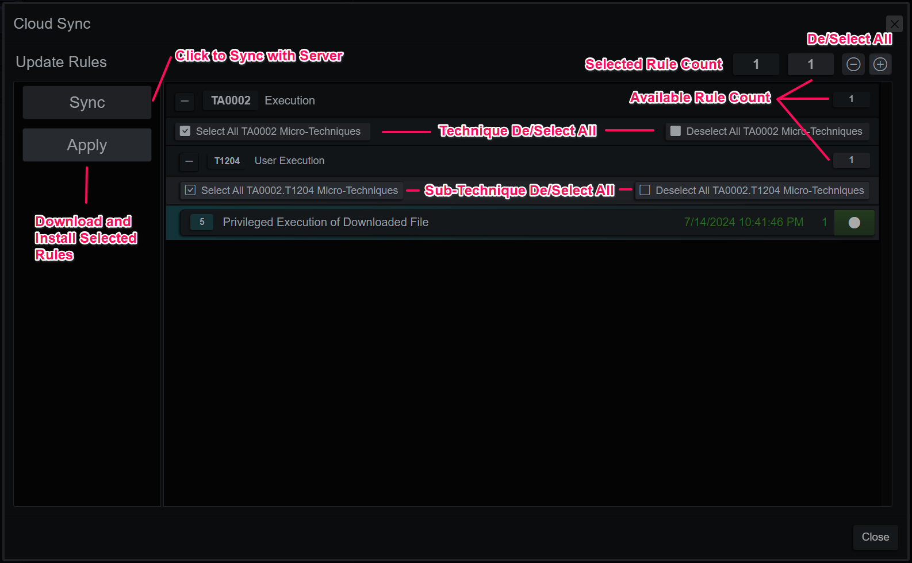
<br><br>

Cloud Sync is used to distribute new Micro-Technique rules to licensed copies of the application, server or client. Click Sync and the application will contact the content server and display the rule deltas in the familiar hierarchy format. When the user is satisfied with the new rule selections, click apply and the rules and any supporting lists will be merged into the rule base.
<br><br>

# Multi-State Configuration Example
The following figures illustrate a rule designed to detect SysInternal tools that include the command line argument fragment “accepteula”. Once it identifies a matching process, the active MT monitors it for a maximum of 60 seconds relative to the machine's time. If the process meets the conditions of the next state, it records network event evidence. The rule verifies the network connection by comparing it to the saved node ID of the originating process. Subsequently, the rule employs multiple static value matches and stored procedural matches to ensure the network connection terminates on a public IP and isn’t a well-known domain. If the process matches the initial step but fails to match any further network events, it exits the rule without recording evidence, freeing up resources.


The rule includes an informational score of 15 and provides a step-by-step description of the desired evidence. On its own, it might seem like a minor piece of evidence, but when integrated into the evidence graph alongside other activities, it can add more clues to an attacker’s true intent.


This is a simple example of the descriptive expressions available for Micro-Technique logic. The power comes from the finite state machine architecture, with this feature you can loosely describe trigger events but make more accurate descriptions of follow on events to ensure the resulting collected evidence is relevant.

*Rule Example State 1*

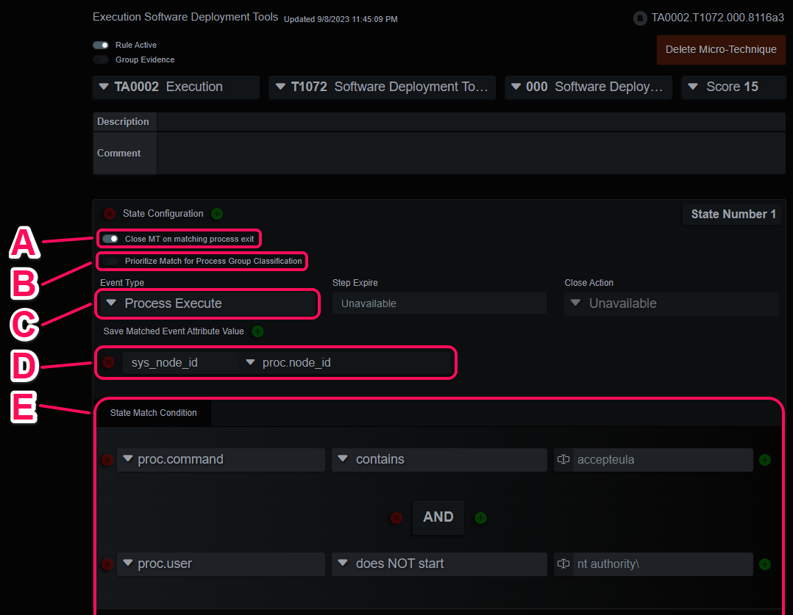
<br><br>

- A. The early close optimization. If the matching process exit event is seen before the next state matches, close the Micro-Technique and register no evidence.
- B. If this is a process event, consider this event when determining process group membership. If there is any other EDR type event, consider the process responsible for this event, if it can be found.
- C. The matching event type, open Micro-Techniques will not execute if the event type of the event doesn't match this first filter.
- D. Save the matching event attribute as a named variable to be used in subsequent matching states.
- E. The Attribute - Operator - Value event comparison operations. Nesting through precedence groups is supported, as are numerous comparison operators. The operators are native type aware, and some are comparable to stored procedures vs simple matches.

*Rule Example State 2*

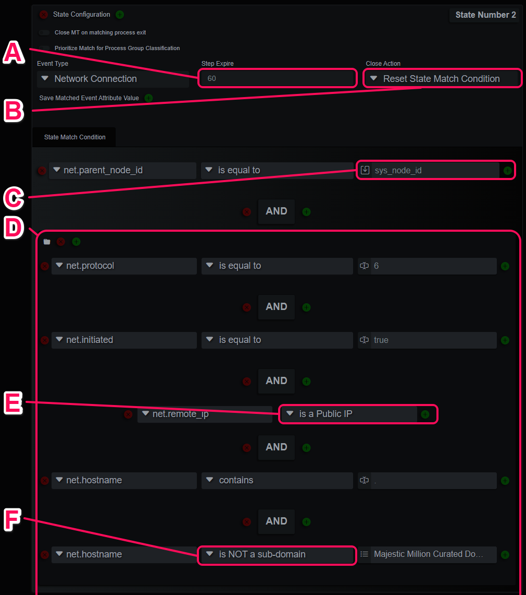
<br><br>


- A. The step expire setting is available on every step except the first. This will close the MT without registering evidence if there is no match in n seconds.
- B. This is the last state, so it can have a Close Action. This rule is configured to reset this last state, but still registers the matching evidence. This will "watch" this process and register network connections under the same rule match for 60 seconds.
- C. Compare the network connection event's Parent Node ID to the saved process Node ID obtained in the initially matched step.
- D. A precedence group container.
- E. A stored procedure comparison operator to produce a Boolean answer to the question, is the remote IP a Public IP address?
- F. Another stored procedure checks to compare the event domain to a list of root domains. This is commonly used to filter known good domains that use a lot of seemingly random CDN subdomain names.


<br><br>
[Back](../guide_menu.md)